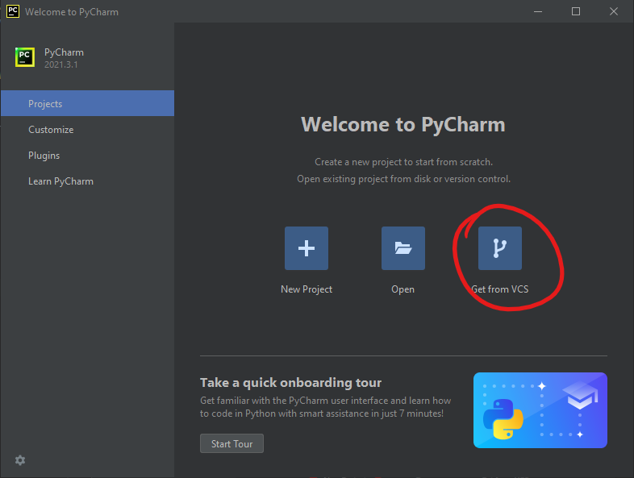
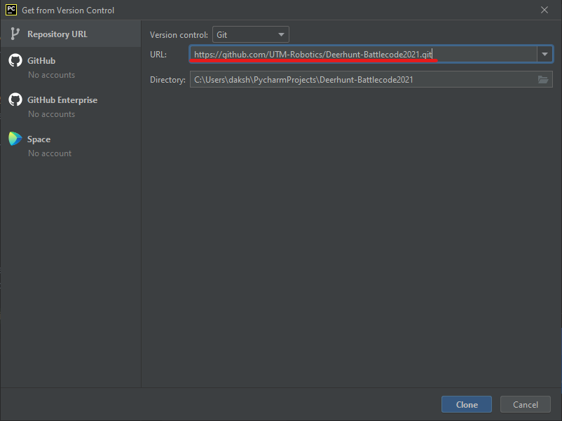
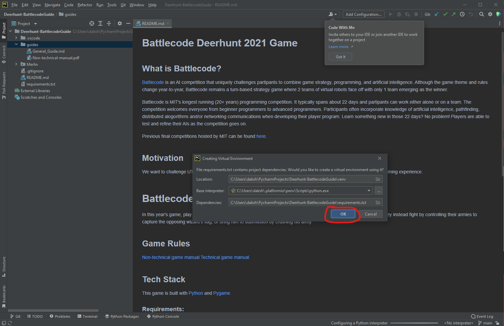
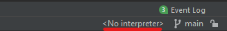
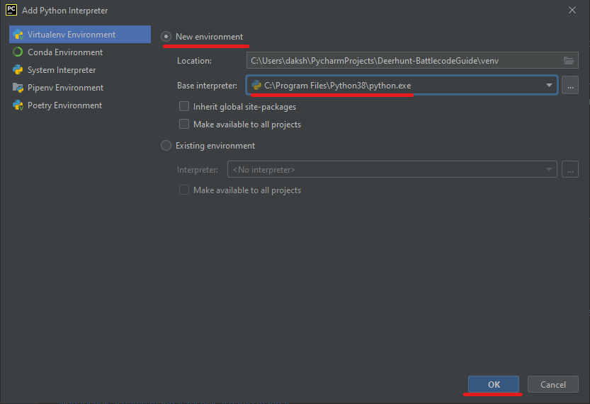
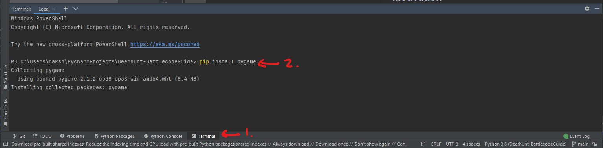
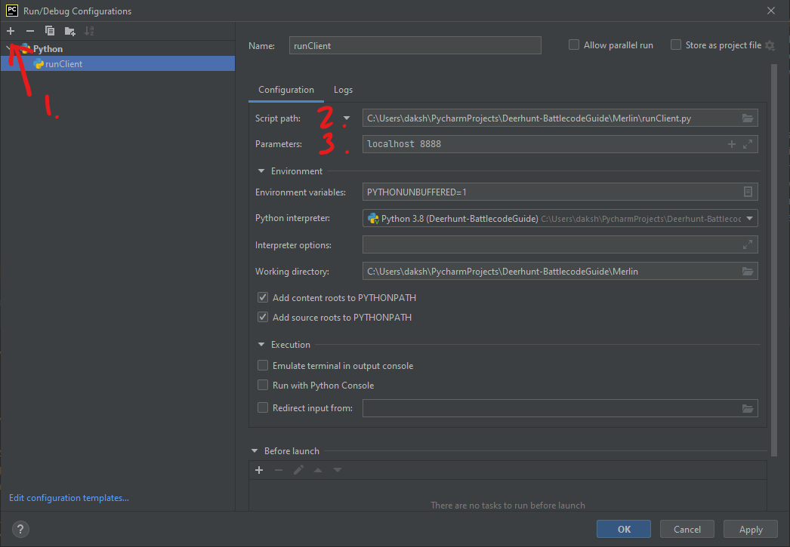
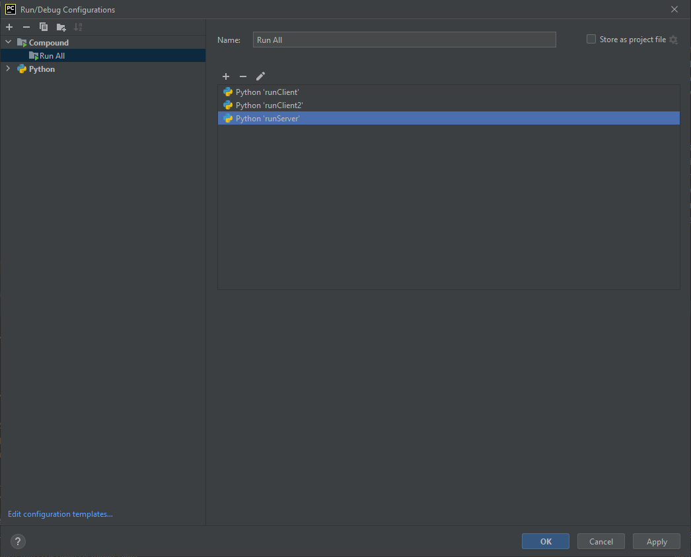

# PyCharm guide

This guide is a quick setup guide to get things running in PyCharm.

---

### Install PyCharm and Python

If you haven't already, install python from the [Python website](https://www.python.org/downloads/).
The latest python version should be fine. Although python 3.9 is recommended as our servers run that.
Lower versions should also work.

You can also install PyCharm from the [Jetbrains website](https://www.jetbrains.com/pycharm/download/).
The community edition is free to use, but the professional edition is free for students, if you [sign up](https://www.jetbrains.com/community/education/#students).

After you have installed pycharm, you can get through the setup screen until you reach the new project landing page.

---

### Cloning the project

1. First page you see is the new project landing page. You want to click on the "Get from VCS" button.

2. Afterwards you will be presented with a screen where you can input the url of the project you want to clone.
Where you want to enter the deerhunt project repository \
   `https://github.com/UTM-Robotics/Deerhunt-Battlecode2021.git` \
   Then click on the "Clone" button.

3. After the project is cloned, you may be presented with a dialog box asking you to create a virtual environment.

   1. If you have this dialog box just click "OK" and proceed to step 5.
   
   2. If you don't have this dialog box, or you clicked "Cancel", then continue to step 4.

4. Click on the "No interpreter" button. on the bottom right of the screen.
   1. Then click "add interpreter"
   2. Select new environment
   3. Double-check the base version is set to the python version you want to use.
   4. Click "OK"

5. Installing dependencies
   1. Click on the terminal tab at the bottom of the screen.
   2. Type `pip install pygame`

6. Setting up client2
   1. Copy the client folder by right-clicking on it and choosing "copy"
   2. Right-click on the merlin folder and choose "paste"
   3. Name the new folder "client2"

7. Setting up run configuration
   1. Click on the Add configuration button at the top right of the screen.
   2. Click on the plus button on the top left of the prompt and select python
   3. Click on the folder icon next to "script path" and select "runClient.py"
   4. For parameters enter `localhost 8888`. If you have issues in the future try changing the port number.
   5. Repeat this setup for client2
   6. For the server same steps except the parameters are `8888 --render` for rendering or just `8888` for no rendering.
   7. Click "Apply"
   8. Add another configuration but select "compound"
   9. In the box add the server, client1, and client2 configurations.
   10. Click "Apply" and "OK"

8. You should now be able to all 3 files at the same time by selecting the "compound" configuration, and clicking "Run".